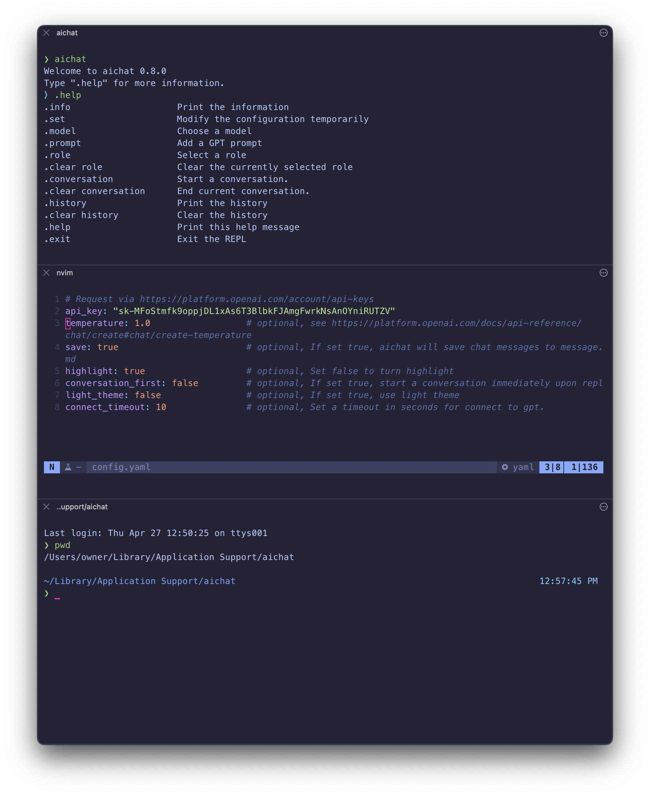

# intelligence-record

ever since i started using chatgpt i have monitored and stored each conversation i have had with it.  of course everyone has a copy of their data, however this data will be formatted automatically into a markdown file and will always accessible to the public world. this is a collection of those conversations view them [here](./messages.md)

### `/Users/owner/Library/Application Support/aichat`

```
❯ tree
.
├── config.yaml
├── history.txt
└── messages.md

1 directory, 3 files
```

###  `python3 monitor.py`

the code is quite simple if you have `shutil` installed with pip3 just a continuous while statement and a few calls to copy and pasta the module into the correct `.git` directory.

```python
import os
import shutil
import time

src_file = '/Users/owner/Library/Application Support/aichat/messages.md'
dest_folder = '/Users/owner/Documents/GitHub/intelligence-record'

last_modification = os.path.getmtime(src_file)

while True:
    if os.path.getmtime(src_file) > last_modification:
        shutil.copy(src_file, dest_folder)
        last_modification = os.path.getmtime(src_file)
        print("file updated! preview it here https://github.com/MorganBergen/intelligence-record.git")
    time.sleep(1)
```

###  configuration 



Thank you for the makers of [aichat](https://github.com/sigoden/aichat) to make this possible
